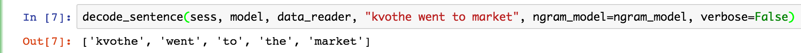
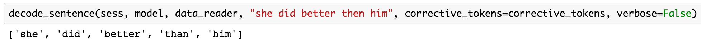

# Deep Text Correcter

Deep Text Correcter uses [TensorFlow](https://www.tensorflow.org/) to train sequence-to-sequence models that are capable of automatically correcting small grammatical errors in conversational written English (e.g. SMS messages). It does this by taking English text samples that are known to be mostly grammatically correct and randomly introducing a handful of small grammatical errors (e.g. removing articles) to each sentence to produce input-output pairs (where the output is the original sample), which are then used to train a sequence-to-sequence model.

## Motivation
While context-sensitive spell-check systems are able to automatically correct a large number of input errors in instant messaging, email, and SMS messages, they are unable to correct even simple grammatical errors. For example, the message "I'm going to store" would be unaffected by typical autocorrection systems, when the user most likely intendend to write "I'm going to _the_ store".

The goal of this project is to train sequence-to-sequence models that are capable of automatically correcting such errors. Specifically, the models are trained to provide a function mapping a potentially errant input sequence to a sequence with all (small) grammatical errors corrected.

## Correcting Grammatical Errors with Deep Learning
The basic idea behind this project is that we can generate large training data sets for the task of grammar correction by starting with grammatically correct samples and introducing small errors to produce input-output pairs.

Instead of using the most probable decoding according to the seq2seq model, this project takes advantage of the unique structure of the problem to impose the prior that all tokens in a decoded sequence should either exist in the input sequence or belong to a set of "corrective" tokens. The "corrective" token set is constructed during training and contains all tokens seen in the target, but not the source, for at least one sample in the training set. The intuition here is that the errors seen during training involve the misuse of a relatively small vocabulary of common words (e.g. "the", "an", "their") and that the model should only be allowed to perform corrections in this domain.

This prior is carried out through a modification to the seq2seq model's decoding loop in addition to a post-processing step that resolves out-of-vocabulary (OOV) tokens:

### Biased Decoding
To restrict the decoding such that it only ever chooses tokens from the input sequence or corrective token set, this project applies a binary mask to the model's logits prior to extracting the prediction to be fed into the next time step. This mask is constructed such that `mask[i] == 1.0 if (i in input or corrective_tokens) else 0.0`. Since this mask is applited to the result of a softmax transormation (which guarantees all outputs are non-negative), we can be sure that only input or corrective tokens are ever selected.

Note that this logic is not used during training, as this would only serve to eliminate potentially useful signal from the model.

### Handling OOV Tokens
Since the decoding bias described above is applied within the truncated vocabulary used by the model, we will still see the unknown token in its output for any OOV tokens. The more generic problem of resolving these OOV tokens is non-trivial (e.g. see [Addressing the Rare Word Problem in NMT](https://arxiv.org/pdf/1410.8206v4.pdf)), but in this project we can again take advantage of its unique structure to create a fairly straightforward OOV token resolution scheme. That is, if we assume the sequence of OOV tokens in the input is equal to the sequence of OOV tokens in the output sequence, then we can trivially assign the appropriate token to each "unknown" token encountered int he decoding. Empirically, and intuitively, this appears to be an appropriate assumption, as the relatively simple class of errors these models are being trained to address should never include mistakes that warrant the insertion or removal of a rare token.

## Implementation
This project reuses and slightly extends TensorFlow's [`Seq2SeqModel`](https://github.com/tensorflow/tensorflow/blob/master/tensorflow/models/rnn/translate/seq2seq_model.py), which itself implements a sequence-to-sequence model with an attention mechanism as described in https://arxiv.org/pdf/1412.7449v3.pdf. The primary contributions of this project are:

- `data_reader.py`: an abstract class that defines the interface for classes which are capable of reading a source data set and producing input-output pairs, where the input is a grammatically incorrect variant of a source sentence and the output is the original sentence.
- `text_correcter_data_readers.py`: contains a few implementations of `DataReader`, one over the [Penn Treebank dataset](https://www.google.com/url?q=http://www.fit.vutbr.cz/~imikolov/rnnlm/simple-examples.tgz&usg=AFQjCNG0IP5OHusdIAdJIrrem-HMck9AzA) and one over the [Cornell Movie-Dialogs Corpus](http://www.cs.cornell.edu/~cristian/Cornell_Movie-Dialogs_Corpus.html).
- `text_correcter_models.py`: contains a version of `Seq2SeqModel` modified such that it implements the logic described in [Biased Decoding](#biased-decoding)
- `correct_text.py`: a collection of helper functions that together allow for the training of a model and the usage of it to decode errant input sequences (at test time). The `decode` method defined herein implements the [OOV token resolution logic](#handling-oov-tokens). This also defines a main method, and can be invoked from the command line. It was largely derived from TensorFlow's [`translate.py`](https://github.com/tensorflow/tensorflow/blob/master/tensorflow/models/rnn/translate/translate.py).
- `TextCorrecter.ipynb`: an IPython notebook which ties together all of the above pieces to allow for the training and evaluation of the model in an interactive fashion.

### Example Usage
TODO

## Experimental Results

### Examples
Decoding a sentence with a missing article:


Decoding a sentence with then/than confusion:


### Aggregate Performance
Below are reported the BLEU and accuracy numbers over a test data set for both a trained model and a baseline, where:
- The model is a 2-layer, 512 hidden unit LSTM model trained with a vocabulary of 2k
- The baseline is the "do nothing" model; i.e. the identity function which assumes no errors exist in the input

You'll notice that the model outperforms this baseline for all bucket sizes in terms of accuracy, and outperforms all but one in terms of BLEU score. This demonstrates the model is capable of providing value.

```
Bucket 0: (10, 10)
        Baseline BLEU = 0.8341
        Model BLEU = 0.8516
        Baseline Accuracy: 0.9083
        Model Accuracy: 0.9384
Bucket 1: (15, 15)
        Baseline BLEU = 0.8850
        Model BLEU = 0.8860
        Baseline Accuracy: 0.8156
        Model Accuracy: 0.8491
Bucket 2: (20, 20)
        Baseline BLEU = 0.8876
        Model BLEU = 0.8880
        Baseline Accuracy: 0.7291
        Model Accuracy: 0.7817
Bucket 3: (40, 40)
        Baseline BLEU = 0.9099
        Model BLEU = 0.9045
        Baseline Accuracy: 0.6073
        Model Accuracy: 0.6425
```
